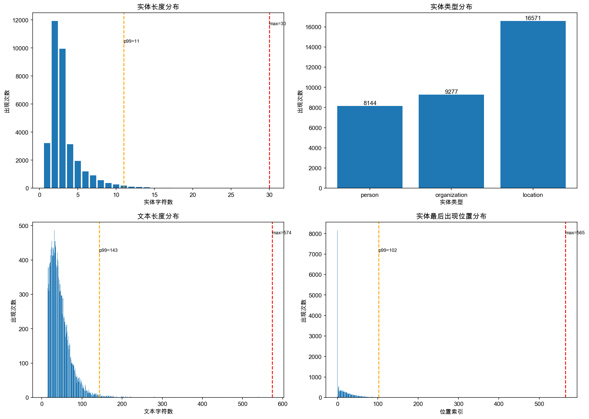
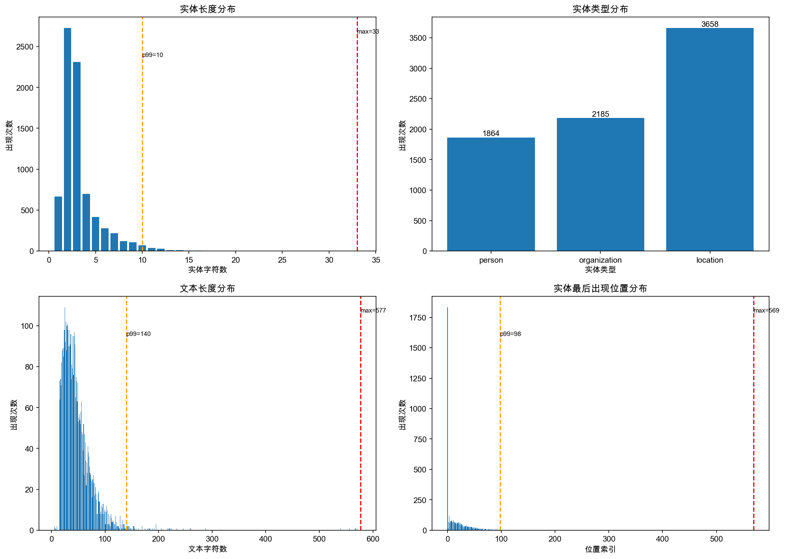
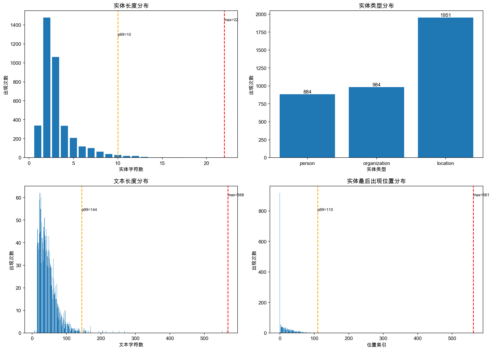

# week07-作业
## 一、数据分析

### 1.1 数据集概览

本项目使用 People's Daily 人民日报中文命名实体识别数据集，包含训练集、验证集和测试集三个部分。数据集标注了三种实体类型：
- **person (PER)**: 人名
- **organization (ORG)**: 机构名
- **location (LOC)**: 地名

### 1.2 数据统计分析

#### 训练集 (train.json)

**实体长度分布统计：**
- 最大值 (max): 30
- 90分位数 (p90): 5
- 95分位数 (p95): 7
- 99分位数 (p99): 11

**实体类型分布统计：**
- organization: 9,277 个
- location: 16,571 个
- person: 8,144 个
- 总计: 33,992 个实体

**文本长度分布统计：**
- 最大值 (max): 574
- 90分位数 (p90): 79
- 95分位数 (p95): 96
- 99分位数 (p99): 143

**实体最后出现位置分布统计：**
- 最大值 (max): 565
- 90分位数 (p90): 47
- 95分位数 (p95): 62
- 99分位数 (p99): 102

**可视化图表：**



*图 1-1：训练集数据分布统计*

---

#### 测试集 (test.json)

**实体长度分布统计：**
- 最大值 (max): 33
- 90分位数 (p90): 5
- 95分位数 (p95): 7
- 99分位数 (p99): 10

**实体类型分布统计：**
- organization: 2,185 个
- location: 3,658 个
- person: 1,864 个
- 总计: 7,707 个实体

**文本长度分布统计：**
- 最大值 (max): 577
- 90分位数 (p90): 79
- 95分位数 (p95): 96
- 99分位数 (p99): 140

**实体最后出现位置分布统计：**
- 最大值 (max): 569
- 90分位数 (p90): 48
- 95分位数 (p95): 64
- 99分位数 (p99): 98

**可视化图表：**



*图 1-2：测试集数据分布统计*

---

#### 验证集 (validation.json)

**实体长度分布统计：**
- 最大值 (max): 22
- 90分位数 (p90): 5
- 95分位数 (p95): 6
- 99分位数 (p99): 10

**实体类型分布统计：**
- organization: 984 个
- location: 1,951 个
- person: 884 个
- 总计: 3,819 个实体

**文本长度分布统计：**
- 最大值 (max): 568
- 90分位数 (p90): 79
- 95分位数 (p95): 96
- 99分位数 (p99): 144

**实体最后出现位置分布统计：**
- 最大值 (max): 561
- 90分位数 (p90): 48
- 95分位数 (p95): 61
- 99分位数 (p99): 110

**可视化图表：**



*图 1-3：验证集数据分布统计*

---

### 1.3 数据分布洞察

#### 实体类型分布特征
- **location 实体最多**：在三个数据集中，地点实体均占比最高（约 45-50%）
- **organization 次之**：机构实体约占 25-28%
- **person 实体最少**：人名实体约占 22-25%
- 数据集类别分布相对均衡，无严重偏斜问题

#### 实体长度特征
- **实体普遍较短**：90% 的实体长度 ≤ 5 个字符
- **长实体罕见**：99% 的实体长度 ≤ 10-11 个字符
- **最大实体长度**：测试集中出现最长实体（33 字符），基本为特殊机构名称

#### 文本长度特征
- **文本长度集中**：90% 的文本长度在 79 字符以内
- **长尾分布**：存在少量超长文本（最大 568-577 字符）
- **p99 阈值**：99% 的文本长度 ≤ 140-144 字符，可作为序列截断参考值
- 根据分析，超长文本应该是数据集的异常点，可以排除或截断，典型数据如下：
```text
tokens: 北京晴转雷阵雨19℃／32℃天津雷阵雨转多云18℃／31℃石家庄晴22℃／36℃太原晴转多云16℃／31℃呼和浩特多云转小雨12℃／23℃沈阳小雨16℃／24℃大连小雨17℃／20℃长春中雨14℃／23℃哈尔滨雷阵雨17℃／26℃上海小雨22℃／27℃南京雷阵雨转多云19℃／29℃杭州中雨21℃／25℃合肥雷阵雨20℃／28℃福州阴转雷阵雨26℃／31℃南昌小雨21℃／28℃济南雷阵雨20℃／30℃青岛雷阵雨17℃／22℃郑州晴转多云23℃／38℃武汉小雨转中雨24℃／28℃长沙中雨转大雨23℃／25℃广州小雨28℃／34℃南宁大雨25℃／30℃海口多云转雷阵雨28℃／36℃成都阴转多云22℃／30℃重庆多云23℃／31℃贵阳小雨转阴18℃／26℃昆明雷阵雨转多云19℃／28℃拉萨小雨转多云11℃／28℃西安晴24℃／35℃兰州晴转多云18℃／30℃西宁多云转雷阵雨14℃／26℃银川晴转雷阵雨13℃／27℃乌鲁木齐晴20℃／32℃台北阴26℃／35℃香港雷阵雨转多云27℃／33℃澳门雷阵雨转多云27℃／33℃东京中雨20℃／28℃曼谷雷阵雨28℃／35℃悉尼晴10℃／19℃卡拉奇晴30℃／44℃开罗晴20℃／37℃莫斯科晴14℃／28℃法兰克福晴15℃／25℃巴黎晴15℃／29℃伦敦晴18℃／28℃纽约阴17℃／30℃
ner_tags: B-LOCI-LOCOOOOOOOOOOOOB-LOCI-LOCOOOOOOOOOOOOOB-LOCI-LOCI-LOCOOOOOOOOB-LOCI-LOCOOOOOOOOOOOB-LOCI-LOCI-LOCI-LOCOOOOOOOOOOOOB-LOCI-LOCOOOOOOOOOB-LOCI-LOCOOOOOOOOOB-LOCI-LOCOOOOOOOOOB-LOCI-LOCI-LOCOOOOOOOOOOB-LOCI-LOCOOOOOOOOOB-LOCI-LOCOOOOOOOOOOOOOB-LOCI-LOCOOOOOOOOOB-LOCI-LOCOOOOOOOOOOB-LOCI-LOCOOOOOOOOOOOOB-LOCI-LOCOOOOOOOOOB-LOCI-LOCOOOOOOOOOOB-LOCI-LOCOOOOOOOOOOB-LOCI-LOCOOOOOOOOOOOB-LOCI-LOCOOOOOOOOOOOOB-LOCI-LOCOOOOOOOOOOOOB-LOCI-LOCOOOOOOOOOB-LOCI-LOCOOOOOOOOOB-LOCI-LOCOOOOOOOOOOOOOB-LOCI-LOCOOOOOOOOOOOB-LOCI-LOCOOOOOOOOOB-LOCI-LOCOOOOOOOOOOOB-LOCI-LOCOOOOOOOOOOOOOB-LOCI-LOCOOOOOOOOOOOOB-LOCI-LOCOOOOOOOOB-LOCI-LOCOOOOOOOOOOOB-LOCI-LOCOOOOOOOOOOOOOB-LOCI-LOCOOOOOOOOOOOOB-LOCI-LOCI-LOCI-LOCOOOOOOOOB-LOCI-LOCOOOOOOOOB-LOCI-LOCOOOOOOOOOOOOOB-LOCI-LOCOOOOOOOOOOOOOB-LOCI-LOCOOOOOOOOOB-LOCI-LOCOOOOOOOOOOB-LOCI-LOCOOOOOOOOB-LOCI-LOCI-LOCOOOOOOOOB-LOCI-LOCOOOOOOOOB-LOCI-LOCI-LOCOOOOOOOOB-LOCI-LOCI-LOCI-LOCOOOOOOOOB-LOCI-LOCOOOOOOOOB-LOCI-LOCOOOOOOOOB-LOCI-LOCOOOOOOOO

tokens: 北京雷阵雨转晴17℃／30℃天津雷阵雨转多云19℃／31℃石家庄晴20℃／34℃太原晴15℃／30℃呼和浩特多云转晴13℃／26℃沈阳雷阵雨14℃／22℃大连多云转阴14℃／20℃长春小雨13℃／22℃哈尔滨雷阵雨10℃／23℃上海多云19℃／25℃南京阴20℃／27℃杭州多云转阴20℃／27℃合肥多云20℃／30℃福州小雨20℃／25℃南昌多云转小雨20℃／26℃济南晴转多云21℃／30℃青岛多云转晴16℃／22℃郑州晴转多云16℃／28℃武汉多云21℃／28℃长沙多云转小雨22℃／32℃广州中雨21℃／27℃南宁大雨转中雨24℃／29℃海口多云转雷阵雨27℃／34℃成都多云转阴20℃／26℃重庆小雨20℃／25℃贵阳阴转多云17℃／25℃昆明小雨16℃／24℃拉萨雷阵雨转多云10℃／25℃西安多云19℃／30℃兰州小雨15℃／26℃西宁小雨8℃／20℃银川晴转阴17℃／24℃乌鲁木齐多云转阴17℃／26℃台北小雨23℃／28℃香港中雨转小雨21℃／28℃澳门中雨转小雨21℃／27℃东京小雨14℃／20℃曼谷小雨26℃／35℃悉尼晴11℃／19℃卡拉奇多云29℃／34℃开罗晴21℃／34℃莫斯科多云14℃／25℃法兰克福阴转小雨14℃／21℃巴黎阴转小雨12℃／18℃伦敦小雨12℃／19℃纽约多云14℃／20℃
ner_tags: B-LOCI-LOCOOOOOOOOOOOOB-LOCI-LOCOOOOOOOOOOOOOB-LOCI-LOCI-LOCOOOOOOOOB-LOCI-LOCOOOOOOOOB-LOCI-LOCI-LOCI-LOCOOOOOOOOOOOB-LOCI-LOCOOOOOOOOOOB-LOCI-LOCOOOOOOOOOOOB-LOCI-LOCOOOOOOOOOB-LOCI-LOCI-LOCOOOOOOOOOOB-LOCI-LOCOOOOOOOOOB-LOCI-LOCOOOOOOOOB-LOCI-LOCOOOOOOOOOOOB-LOCI-LOCOOOOOOOOOB-LOCI-LOCOOOOOOOOOB-LOCI-LOCOOOOOOOOOOOOB-LOCI-LOCOOOOOOOOOOOB-LOCI-LOCOOOOOOOOOOOB-LOCI-LOCOOOOOOOOOOOB-LOCI-LOCOOOOOOOOOB-LOCI-LOCOOOOOOOOOOOOB-LOCI-LOCOOOOOOOOOB-LOCI-LOCOOOOOOOOOOOOB-LOCI-LOCOOOOOOOOOOOOOB-LOCI-LOCOOOOOOOOOOOB-LOCI-LOCOOOOOOOOOB-LOCI-LOCOOOOOOOOOOOB-LOCI-LOCOOOOOOOOOB-LOCI-LOCOOOOOOOOOOOOOB-LOCI-LOCOOOOOOOOOB-LOCI-LOCOOOOOOOOOB-LOCI-LOCOOOOOOOOB-LOCI-LOCOOOOOOOOOOB-LOCI-LOCI-LOCI-LOCOOOOOOOOOOOB-LOCI-LOCOOOOOOOOOB-LOCI-LOCOOOOOOOOOOOOB-LOCI-LOCOOOOOOOOOOOOB-LOCI-LOCOOOOOOOOOB-LOCI-LOCOOOOOOOOOB-LOCI-LOCOOOOOOOOB-LOCI-LOCI-LOCOOOOOOOOOB-LOCI-LOCOOOOOOOOB-LOCI-LOCI-LOCOOOOOOOOOB-LOCI-LOCI-LOCI-LOCOOOOOOOOOOOB-LOCI-LOCOOOOOOOOOOOB-LOCI-LOCOOOOOOOOOB-LOCI-LOCOOOOOOOOO

tokens: 环境管理体系认证国家认可制度规定：在我国从事环境管理体系认证的人员必须经过中国认证人员国家注册委员会环境管理专业委员会的考核注册，取得国家认可的审核员注册资格，环境管理体系审核员培训课程须经环注委审查注册；在我国开展环境管理体系认证工作的机构必须经过中国环境管理体系认证机构认可委员会的评审和认可方可开展认证工作，国外认证机构在我国开展认证工作也必须取得环认委的认可批准；环境管理体系认证咨询机构从事环境管理体系咨询活动需向国家环保总局备案；应本着自愿的原则鼓励企业及其他组织通过建立并保持一个有效的环境管理体系来改善自身的环境管理水平。
ner_tags: OOOOOOOOOOOOOOOOOOOOOOOOOOOOOOOOOOOOOB-ORGI-ORGI-ORGI-ORGI-ORGI-ORGI-ORGI-ORGI-ORGI-ORGI-ORGI-ORGI-ORGI-ORGI-ORGI-ORGI-ORGI-ORGI-ORGI-ORGI-ORGI-ORGOOOOOOOOOOOOOOOOOOOOOOOOOOOOOOOOOOOOOOOOOOOOOOOOOOOOOOOOOOOOOOOOOOB-ORGI-ORGI-ORGI-ORGI-ORGI-ORGI-ORGI-ORGI-ORGI-ORGI-ORGI-ORGI-ORGI-ORGI-ORGI-ORGI-ORGOOOOOOOOOOOOOOOOOOOOOOOOOOOOOOOOOOOB-ORGI-ORGI-ORGOOOOOOOOOOOOOOOOOOOOOOOOOOOOOOOOB-ORGI-ORGI-ORGI-ORGI-ORGI-ORGOOOOOOOOOOOOOOOOOOOOOOOOOOOOOOOOOOOOOOOOOOOOOOOOOOO

tokens: 今年1月底达沃斯“世界经济论坛”上普遍认可的问题之一是，对付金融危机需要制定新的规章制度；2月下旬在伦敦召开的西方七国财长和央行行长会议强调，要“想办法加强国际金融体系的基础结构”，要“进一步采取行动，加强金融体系及其运作”；近来，美国财长鲁宾在多个场合均表示要为改革国际金融体系作准备，美国联邦储备委员会主席格林斯潘也要求“彻底改革”国际金融体系；日本大藏省官员认为，应考虑建立一种类似布雷顿森林体系的国际金融体制；就连金融投机家索罗斯也建议设立新的国际信贷保险机构。
ner_tags: OOOOOB-LOCI-LOCI-LOCOB-ORGI-ORGI-ORGI-ORGI-ORGI-ORGOOOOOOOOOOOOOOOOOOOOOOOOOOOOOOOOOOOB-LOCI-LOCOOOOOOOOOOOOOOOOOOOOOOOOOOOOOOOOOOOOOOOOOOOOOOOOOOOOOOOOOOOOOOOOB-LOCI-LOCOOB-PERI-PEROOOOOOOOOOOOOOOOOOOOOOB-ORGI-ORGI-ORGI-ORGI-ORGI-ORGI-ORGI-ORGI-ORGOOB-PERI-PERI-PERI-PEROOOOOOOOOOOOOOOOB-ORGI-ORGI-ORGI-ORGI-ORGOOOOOOOOOOOOOOB-ORGI-ORGI-ORGI-ORGI-ORGOOOOOOOOOOOOOOOOOB-PERI-PERI-PEROOOOOOOOOOOOOOOO

```

#### 实体位置分布特征
- **实体多出现在文本前半段**：90% 的实体最后出现位置 ≤ 47-48
- **位置分布与文本长度相关**：实体位置分布趋势与文本长度分布基本一致
- **边界效应**：极少数实体出现在文本末尾（p99 位置约 98-110）
- 说明实体在文本中的分布较为均匀，无明显的位置偏置

### 1.4 对模型设计的指导意义

1. **序列长度设置**：建议 `max_length=150`，可覆盖 99% 的样本，平衡计算效率与信息完整性
2. **实体识别策略**：由于实体普遍较短（≤5 字符），模型应重点关注局部上下文特征
3. **类别权重调整**：三类实体数量相对均衡，可不使用类别权重或仅轻微调整
4. **数据增强方向**：可适当增加 person 和 organization 实体的样本数量，使分布更均衡
5. **评估指标关注**：鉴于 location 实体占比最高，需确保各类别的 F1 分数均衡，避免被大类主导

### 1.5 可视化图表说明

每个数据集均生成包含四个子图的统计分析图：
1. **实体长度分布**：展示不同长度实体的频次，标注 max 和 p99 阈值线
2. **实体类型分布**：对比三类实体的数量差异
3. **文本长度分布**：展示样本长度的整体分布情况
4. **实体最后出现位置分布**：反映实体在文本中的位置偏好


